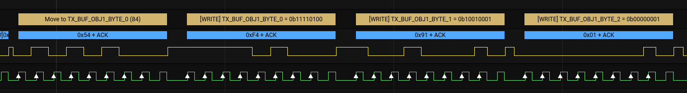
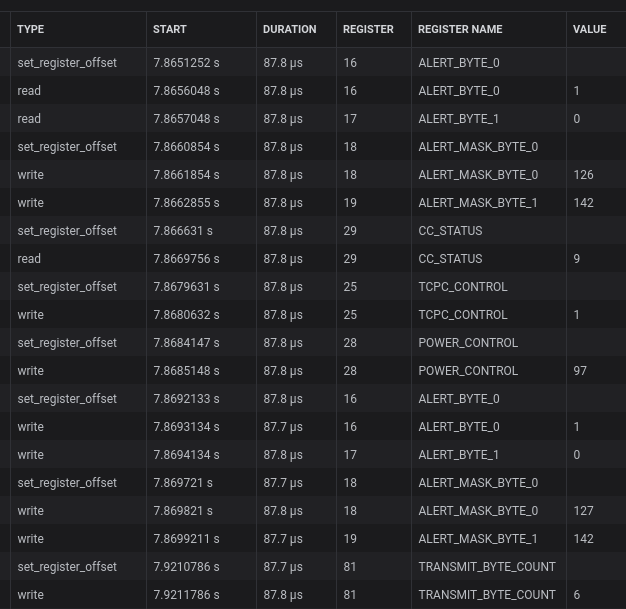

# TUSB422 USB Type-C PD i2c Analyzer

This extension includes a High Level Analyzer for the TUSB422 USB Type-C Power Delivery Controller. It supports converting i2c transactions into read and write frames, and translating register sub-addresses into human-readable names. It does not currently decode register values.

To use, simply add an `i2c` analyzer to your TUSB422 channels, and add the `TUSB422` HLA using the `i2c` analyzer as input.

## Screenshots

### Graph

### Data Table

